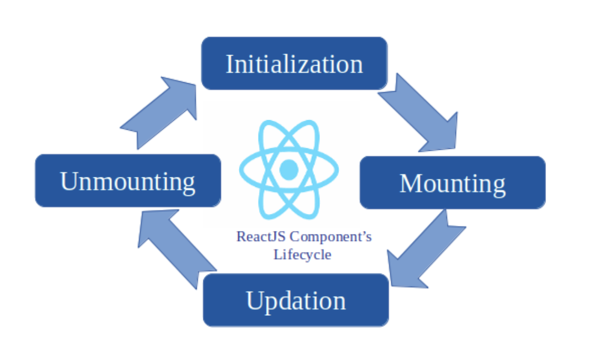
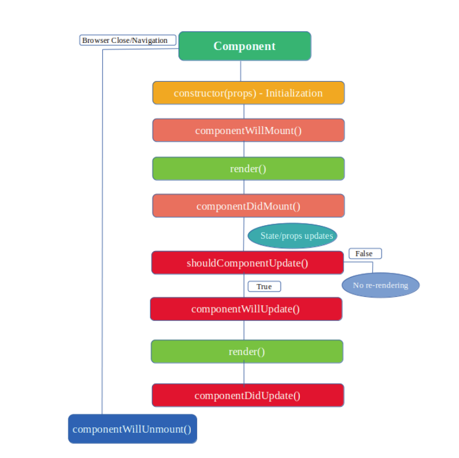

## Interview question in javascript

| sources                                                                                                      |                                                                      |                                          |
| ------------------------------------------------------------------------------------------------------------ | -------------------------------------------------------------------- | ---------------------------------------- |
| [How to understand a component’s lifecycle methods in ReactJS](https://www.freecodecamp.org/news/how-to-understand-a-components-lifecycle-methods-in-reactjs-e1a609840630/) | [component’s lifecycle ](https://www.freecodecamp.org/news/how-to-understand-a-components-lifecycle-methods-in-reactjs-e1a609840630/) | [online-markdown](https://dillinger.io/) |


## Table of Contents

- [¿How to understand a component’s lifecycle methods in ReactJS?](#How-to-understand-a-component’s-lifecycle-methods-in-ReactJS)

## How to understand a component’s lifecycle methods in ReactJS



-  Components are created (**mounted** on the DOM), grow by updating, and then die (unmount on DOM). This is referred to as a component lifecycle.

1. initialization
2. mounting
3. updating, and
4. unmounting

#### initialization

- This is the phase in which the component is going to start its journey by setting up the state (see below) and the props. This is usually done inside the constructor method (see below to understand the initialization phase better).

```
class Initialize extends React.Component {
    constructor(props)
    {
    // Calling the constructor of
    // Parent Class React.Component
    super(props);
    // initialization process
    this.state = {
       date : new Date(),
       clickedStatus: false
     };
}
```


#### mounting
- Mounting is the phase in which our React component mounts on the DOM (i.e., **is created and inserted into the DOM**).

- The methods that are available in this phase are:

1. componentWillMount():
- This method is called just before a component mounts on the DOM or the render method is called. After this method, the component gets mounted.
**Note**: You should not make API calls or any data changes using this.setstate in this method because it is called before the render method. 

2. componentDidMount():
- This method is called after the component gets mounted on the DOM. Like componentWillMount, it is called once in a lifecycle. 


#### updating
- This is where component’s state changes and hence, re-rendering takes place.
- In this phase, the data of the component (state & props) updates in response to user events like clicking, typing and so on. This results in the re-rendering of the component. The methods that are available in this phase are:

1. shouldComponentUpdate():
- This method determines whether the component should be updated or not. By default, it returns true. But at some point, if you want to re-render the component on some condition, then shouldComponentUpdate method is the right place.

2. componentWillUpdate():
- It is called before the re-rendering of the component takes place. It is called once after the ‘shouldComponentUpdate’ method. If you want to perform some calculation before re-rendering of the component and after updating the state and prop, then this is the best place to do it. 


3. ComponentDidUpdate():
- This method is called just after the re-rendering of the component. After the new (updated) component gets updated on the DOM, the ‘componentDidUpdate’ method is executed. This method receives arguments like prevProps and prevState.

#### unmounting
- This is the last phase in the component’s lifecycle. he component gets unmounted from the DOM in this phase. 
The method that is available in this phase is:

1. shouldComponentUpdate():
- This method is called before the unmounting of the component takes place. Before the removal of the component from the DOM, ‘componentWillUnMount’ executes. This method denotes the end of the component’s lifecycle.


