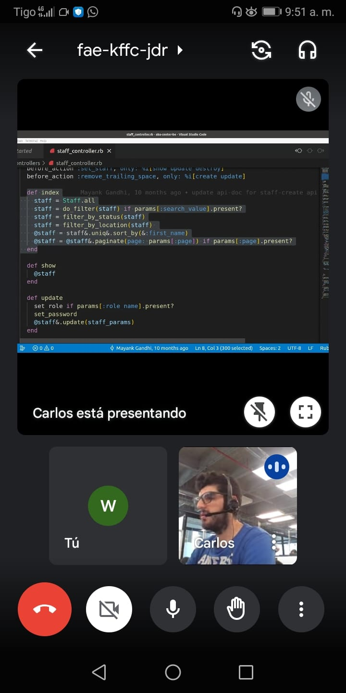

# Ruby and Ruby on Rails Interview Questions

## Ruby Basics

### 1. Is everything in Ruby an object?
- **Answer**:  
  Methods are not objects. Blocks are not objects. Keywords are not objects. However, there exist Method objects and Proc objects, and some keywords refer to objects.

### 2. What is a Proc?
- **Answer**:  
  Procs are anonymous methods (or nameless functions) containing code. They can be placed inside a variable and passed around like any other object or scalar value. They are created by `Proc.new`, `lambda`, and blocks (invoked by the `yield` keyword).

### 3. Types of Variables in Ruby
- **Resources**:  
  - [Struggling with Ruby - Variables](https://strugglingwithruby.blogspot.com/2010/03/variables.html)  
  - [RubySur - Classes](http://rubysur.org/aprende.a.programar/capitulos/clases.html)  

  **Types**:
  - Global Variables
  - Class Variables
  - Instance Variables

### 4. What are Ruby Blocks?
- **Resource**:  
  [Understanding Ruby Blocks](https://medium.com/@noordean/understanding-ruby-blocks-3a45d16891f1)

### 5. What are Blocks, Procs, and Lambdas in Ruby?
- **Resource**:  
  [Bloques, Procs y Lambdas en Ruby](https://medium.com/academia-hack/bloques-procs-y-lambdas-en-ruby-7b01140921bb)

### 6. What are Symbols in Ruby?
### 7. Difference Between Symbols and Strings
### 8. What is Garbage Collection in Ruby?

---

## Ruby on Rails Concepts

### 9. What is an ORM?
- **Resource**:  
  [What is ORM?](https://www.google.com/search?q=orm&oq=orm&aqs=chrome..69i57j35i39j0l3j69i65.1215j0j7&sourceid=chrome&ie=UTF-8)

### 10. What is Active Record and How Does It Work?
- **Resource**:  
  [What is Active Record?](https://blog.nearsoftjobs.com/que-es-active-record-y-como-funciona-cbfc7910541f)

### 11. What is Object-Oriented Programming?
### 12. What are Inheritance and Polymorphism?
### 13. What is the Difference Between `render` and `redirect_to`?
### 14. What is a Helper in Ruby on Rails?
### 15. Can Helpers Be Used in Models?
### 16. What is the Difference Between `sort` and `order`?
### 17. What is a Partial in Rails?

---

## Miscellaneous Questions

### 18. What Can You Say About This Code?
- **Image**:  
  

---

### Additional Topics to Explore
- **What is the Rails Asset Pipeline?**
- **What is Polymorphic Association in Rails?**
- **How Does Rails Protect Against SQL Injection?**
- **How to Handle Shared Logic Across Controllers?**
- **Scaling a Rails Application for Millions of Users**

