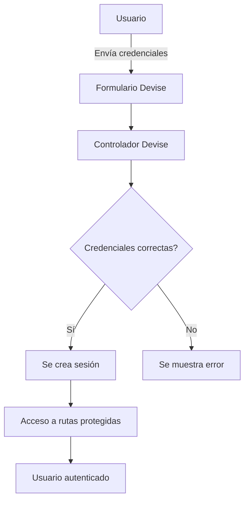

-----------------------------------------------------------------------------------------------------------------
16. Que es Authentication en Ruby on Rails? 
16.1  Historia del concepto / ¿ Por qué lo inventaron ?
16.2  Ventajas: 
16.3  Desventajas:
16.4 Ejemplo en producción 

# Authentication en Ruby on Rails

## Concepto

La autenticación (Authentication) es el proceso de verificar la identidad de un usuario antes de permitirle acceder a un sistema. Se asegura de que la persona que intenta iniciar sesión es quien dice ser, normalmente mediante credenciales como usuario y contraseña.

## Historia del concepto / Por qué lo inventaron

La autenticación existe desde que se desarrollaron los primeros sistemas multiusuario. Su objetivo es proteger la información y los recursos de acceso no autorizado. En aplicaciones web, la autenticación se vuelve crítica para asegurar que solo usuarios autorizados puedan interactuar con ciertas funcionalidades o datos.

En Ruby on Rails, la autenticación se maneja generalmente mediante gemas como **Devise**, **Authlogic** o **Clearance**, que simplifican la implementación de sesiones, registro de usuarios, recuperación de contraseña, y manejo de tokens de autenticación.

## Ejemplo

Un ejemplo básico usando **Devise** en Rails:

```ruby
# Gemfile
gem 'devise'

# Terminal
bundle install
devise:install
devise User
rails db:migrate

# app/controllers/application_controller.rb
class ApplicationController < ActionController::Base
  before_action :authenticate_user!
end
```

Este ejemplo configura Devise, crea un modelo User y requiere autenticación para acceder a cualquier acción del controlador.

## Ventajas

* Simplifica el manejo de usuarios y sesiones.
* Incluye funcionalidades de seguridad robustas como recuperación de contraseñas, confirmación de emails y bloqueo de cuentas.
* Compatible con autenticación por tokens para APIs.

## Desventajas

* Puede ser complejo para personalizaciones muy específicas.
* Añade dependencias externas al proyecto (gemas).
* La sobrecarga de funciones no siempre es necesaria en aplicaciones pequeñas.

## Ejemplo en producción

En una aplicación Rails de comercio electrónico, la autenticación permite que solo los usuarios registrados puedan realizar compras, revisar su historial de pedidos y administrar sus métodos de pago. Devise se encarga de manejar la creación de cuentas, inicio de sesión seguro, y recuperación de contraseña sin necesidad de implementar estas funcionalidades desde cero.


# Authentication en Ruby on Rails

## Concepto

La autenticación (Authentication) es el proceso de verificar la identidad de un usuario antes de permitirle acceder a un sistema. Se asegura de que la persona que intenta iniciar sesión es quien dice ser, normalmente mediante credenciales como usuario y contraseña.

## Historia del concepto / Por qué lo inventaron

La autenticación existe desde que se desarrollaron los primeros sistemas multiusuario. Su objetivo es proteger la información y los recursos de acceso no autorizado. En aplicaciones web, la autenticación se vuelve crítica para asegurar que solo usuarios autorizados puedan interactuar con ciertas funcionalidades o datos.

En Ruby on Rails, la autenticación se maneja generalmente mediante gemas como **Devise**, **Authlogic** o **Clearance**, que simplifican la implementación de sesiones, registro de usuarios, recuperación de contraseña, y manejo de tokens de autenticación.

## Ejemplo

Un ejemplo básico usando **Devise** en Rails:

```ruby
# Gemfile
gem 'devise'

# Terminal
bundle install
devise:install
devise User
rails db:migrate

# app/controllers/application_controller.rb
class ApplicationController < ActionController::Base
  before_action :authenticate_user!
end
```

Este ejemplo configura Devise, crea un modelo User y requiere autenticación para acceder a cualquier acción del controlador.

## Cómo funciona la autenticación con Devise

1. **Registro de usuario**: Devise crea formularios y rutas automáticas para registro (`sign_up`). La contraseña se guarda de manera segura usando hashing.
2. **Inicio de sesión**: El usuario envía correo y contraseña, Devise compara con la base de datos y crea una sesión si las credenciales son correctas.
3. **Protección de rutas**: `before_action :authenticate_user!` asegura que solo usuarios autenticados puedan acceder a ciertas páginas.
4. **Recuperación y confirmación**: Devise maneja recuperación de contraseña, confirmación de email y bloqueo de cuenta automáticamente.

## Diagrama de flujo de Devise



## Ventajas

* Simplifica el manejo de usuarios y sesiones.
* Incluye funcionalidades de seguridad robustas como recuperación de contraseñas, confirmación de emails y bloqueo de cuentas.
* Compatible con autenticación por tokens para APIs.

## Desventajas

* Puede ser complejo para personalizaciones muy específicas.
* Añade dependencias externas al proyecto (gemas).
* La sobrecarga de funciones no siempre es necesaria en aplicaciones pequeñas.

## Ejemplo en producción

En una aplicación Rails de comercio electrónico, la autenticación permite que solo los usuarios registrados puedan realizar compras, revisar su historial de pedidos y administrar sus métodos de pago. Devise se encarga de manejar la creación de cuentas, inicio de sesión seguro, y recuperación de contraseña sin necesidad de implementar estas funcionalidades desde cero.

